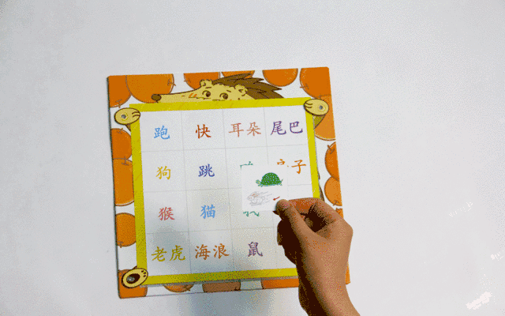
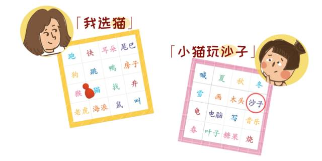
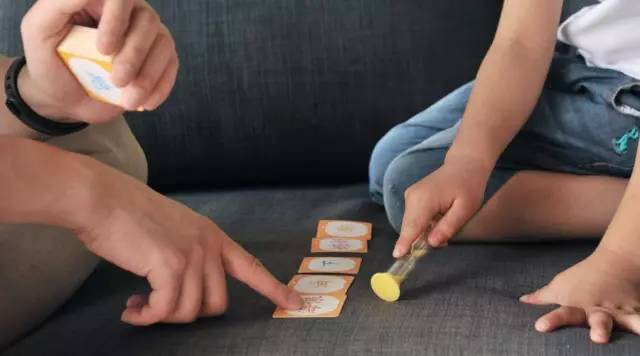

## 标题：（没想好

### 贝贝妈的……日记？

今天是贝贝四岁的生日呀。

现在贝贝和她外婆正在客厅玩游戏呢。停下敲键盘的双手，我悄悄地听起来：

> 外婆：『……贝贝，我们来用「包子」造句～』

> 贝贝（托腮）：「……」

> 外婆：「贝贝的脸像包子。」

> 贝贝（认真状）：「那外婆早上吃了两个贝贝！」

看着她们说说笑笑的背影，心里只有温暖与感恩。想想一年多前那个敏感焦虑的自己，觉得些许愧疚。

贝贝两岁左右时，正是我和贝贝的爸爸事业最忙碌的时期。平常要加班出差赚钱养家，很少有大把时间照顾贝贝的生活。孩子的大部分时间都被早教班占去，每每看着孩子在那里肆意的笑容，和离开时不舍的表情，我总觉得有些嫉妒，又有些歉疚。我总想给贝贝一个有温暖亲情包围的家庭环境，但又苦于自己忙碌不堪。

焦虑之际，母亲从南方的小县城一路来到北京，自告奋勇地想要帮忙照顾孩子。但像千千万万个隔代抚养孩子的家庭那样，从一开始我和母亲就冲突不断。

想到当时，两岁的贝贝似乎对绘本上的字很感兴趣。她会指着绘本上的字，问「这个是什么呀？」和「这个念什么呀？」。看着贝贝稚气的充满求知的小脸，我觉得似乎该教她认字了。我是那么开心又激动，但又小心翼翼地收起情绪，浏览网页又翻阅书籍，思前想后觉得应该要为她具体做些什么。

我仔仔细细地挑选美观的小卡片，购买时下流行的应用教程，想让母亲带着孩子在家学认字。按照看到的育儿文章，我一步步指导母亲该如何引导孩子的注意，让贝贝去记住字的结构和意思。可铺天盖地的「该」与「不该」让母亲无法招架，手机应用里眼花缭乱的按键也让她不知所措。疲惫了一天回到家，看到贝贝毫无兴趣地盯着识字卡片，迷茫的小脸总转向一边，我总会心急，责怪母亲没有认真教她。可母亲也很委屈，无奈自己的教育不够，连手机都不大会用，抱怨小贝贝其实对识字没有兴趣——「当初养你的时候也是等你上学才学的写字呀」。最后，她总回到那声叹息：为什么我总是「吃力不讨好」。

这样的争吵似乎变成了常态，我的「科学育儿」的观点总和母亲的「经验之谈」冲突。母亲并不知道，入学前教贝贝识字可以减轻她上学时好多课业压力。总摆出圣旨般的「科学」和「专家说」，与吓人的「不这样的话就会那样」，我渐渐意识到我似乎在向自己的母亲施压。面对贝贝的进步或是停滞不前，她变得战战兢兢，忧愁着不知道什么是「科学」的应对措施，生怕没有抓住所谓「适时」的机会引导贝贝。每当怒气消退，看着贝贝在客厅里默默地玩着游戏，母亲在一旁安静地收拾，我总感到内疚——自己似乎同冷酷的时间一样，正在任性地消耗着母亲有限的精力。

当贝贝三岁左右时，我找到了 @爱贝睿，抱着尝试的心态买了识字产品「吃汉字的小刺猬」。在这个小小桌游里，贝贝成为了一只「小刺猬」的主人，字和词像是一颗颗「果子」。贝贝只有多认识字，才可以喂饱「小刺猬」。每一天打开盒子，贝贝看到的不是单调的字卡，而是鲜活的「果子」，与欢乐的游戏任务。（_请注意以下游戏图片均来自_[此链接](https://mp.weixin.qq.com/s?__biz=MzAwNzUyODQxOQ==&mid=2651541410&idx=1&sn=e2bac26363a8e55144a97f747892de7e&chksm=8083252eb7f4ac3887367ebf86ddb1ad5a984c9931353869868b427259cbf499d39cb4ae3d1e&scene=4&rd2werd=1#wechat_redirect)）

（[「汉字配对」](https://mp.weixin.qq.com/s/kLXGk4LD6xWH6e-l5vgGKw)）

（[「组词造句」](https://mp.weixin.qq.com/s/DLtmfyoucXchG3UagX51PA)）

（[「记忆游戏」](https://mp.weixin.qq.com/s/ZfggA0W41NVJ-DAlHFqPKQ)）

从贝贝打开盒子的那一刻起，我越发觉得这个小小盒子似乎是为她量身定做的，**每个游戏的难度都恰如其分地配合着她小脑袋的发育，游戏的形式也总能调动她的积极性**。贝贝肉乎乎的小手抓起字卡，一点一点地，从**熟悉简单的字，到接触复杂的词组**；从**匹配字的结构和意思**，到**运用字词造句**。没有高高在上的「说教」，这样零距离的「科学」让我和贝贝的外婆在这条路上不必再纠结于「什么是下一步」，也不再忧虑于「这对于贝贝是否太难」。贝贝的外婆也很快记住了简单的游戏形式，成为了贝贝在每场小识字比赛里的「对手」。每天回到家，贝贝总拉着她的外婆：「我们快来喂小刺猬！」。在和贝贝的互动中，母亲终于可以卸下所有的「该」与「不该」，在游戏里和贝贝轻松「过招」，和贝贝一起为「小刺猬」争取果实。从此家里多了那么多欢声笑语。

**「吃汉字的小刺猬」让我第一次发现「科学」可以是简单好玩的**。它也终于不把母亲「拒之门外」。像我们当初看着贝贝学蹒跚学步那样，一步一步地，我们欣喜于她每天的进步。回头看看，在这短短几个月时间里，贝贝已经认识了400个字，还会用学到的字词造句。到现在我都清晰地记得，她最开始骄傲地说出的那几个句子：

> 「宝贝爱妈妈！」

> 「宝贝爱家人！」

我始终感恩，贝贝一点一滴的进步和贝贝外婆在我和贝贝身后的默默付出。当我终日奔波于工作，晚上在拥挤的地铁中疲惫不堪，只要想到家里有她们陪伴着对方，想到在暖黄色灯光下她们的笑颜，嘴角总会泛起微笑。

([此为图片链接](http://www.58pic.com/newpic/25899503.html)，需下载)

啊！给贝贝订的蛋糕应该快到了吧。等下你要不要一起来给她过生日呢？

------------------------------------------------------------

（_以下一波硬广？是否有图片或视频形式的硬广（可插在这里）？_）：

「吃汉字的小刺猬」，陪伴孩子3-6岁的识字神器，一万妈妈的选择。好评如潮，稳居市场销售量前列。Dr.魏教女儿识字的秘密武器！售价只要：¥298？？？？

------------------------------------------------------------

相关链接：
+ 孩子认字要多早开始？什么是有效的认字方法？——[这三种让孩子认字的方法，你用对了吗？](https://mp.weixin.qq.com/s?__biz=MzAwNzUyODQxOQ==&mid=2651541534&idx=1&sn=54ad638ad5e72acddf6d873bbd11dba2&scene=0#wechat_redirect&rd2werd=1#wechat_redirect)
+ 「吃汉字的小刺猬」操作指南 ——[Dr. 魏的盒子介绍](https://mp.weixin.qq.com/s?__biz=MzAwNzUyODQxOQ==&mid=2651541534&idx=2&sn=339b5332f0380ed7fe402f5b5013d0ed&scene=0#wechat_redirect&rd2werd=1#wechat_redirect)
+ 隔代养育现状分析及应对指南 ——[老人帮带娃，如何「相爱」不「相杀」？](https://mp.weixin.qq.com/s?__biz=MzAwNzUyODQxOQ==&mid=2651544579&idx=2&sn=aa37dd7448ff228f2d81d9f85c7b885f&scene=0#wechat_redirect&rd2werd=1#wechat_redirect)

Some Suggestions:
+ ~~场景：造句。积极词汇~~
+ ~~关键期 -->「窗口期」。注：换了一种表达。用「窗口期」似乎有些出戏~~
+ ~~confirm 时期（两岁是否开始问字？）~~
+ ~~图片插入（配对等）~~
+ 当说到识字卡：淘宝flashcards、识字表
+ ~~电子产品 --> app。注：换成了手机应用~~
+ 可以提到使用电子产品对孩子视力不好 + 老人／小孩操作有困难
+ 问佳妮建议，还有产品对比
+ 呼应「老人觉得识字不用太早」，前后对比要强（抓住重点对比）。逻辑更清晰
+ 呼应痛点，有东西没有讲透
+ 微信文章简洁，「收着写」。与其面面俱到，不如重点展开
+ ~~加强、突出对产品的描写~~
+ ~~「科学」的部分要写出来。注：根据佳妮提供的线索，盒子的「科学性」主要体现于按照孩子认知发展细分了任务~~
+ ~~最后一句改。注：删除了~~
+ 贯穿情感路线，无硬广。插入魏老师视频

预计：下周二的头条
